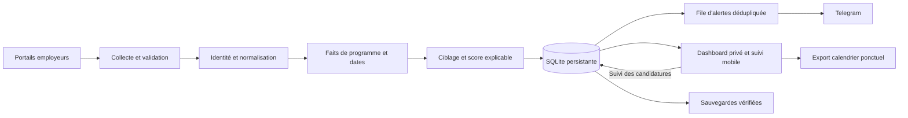

# Stages off-cycle et longs : périmètre et architecture

Le périmètre demandé ajoute les **off-cycle et stages longs (6–12 mois)** au
radar existant, avec l'année cible **2027**, les mêmes métiers et les mêmes
zones. Les Summer Internships, alternances, événements de découverte et postes
Associate seuls restent hors des alertes de stages. La configuration du VPS
conserve sa sélection de sources ; le catalogue du dépôt ne représente pas
automatiquement des sources actives en production.

## Faits distincts du ciblage

`programmes.py` décrit le type de programme, ses formats, son année et les
preuves reconnues. Le titre et le contrat explicites, les périodes de début
vérifiées et l'analyse déjà auditée des descriptions Jane Street constituent
ces preuves. `Full time` décrit les horaires : il n'annule pas un titre de stage.
L'année de publication, de diplôme ou une mention générale du programme dans
la description ne devient pas une année de début.

Les contradictions sont conservées : SIG New Graduates avec contrat INTERN,
années de début divergentes et Summer/off-cycle simultanés. Une durée de
3–6 mois n'est pas classée comme stage long. Un format ou une année inconnu
reste visible et peut être pertinent, mais ne déclenche pas d'alerte de stage.
Les exigences d'expérience, les métiers non ciblés et le niveau Associate
continuent de s'appliquer.

## Activation et conservation

Les réglages sont `include_internships`, `internship_alerts_enabled`,
`internship_formats: [off_cycle, long]`, `internship_target_year: 2027` et
`internship_baseline_at` (instant UTC avec fuseau). Les valeurs par défaut
restent désactivées pour les installations non révisées. Le scanner et le
diagnostic de sources élargissent seulement les exclusions de titres de stages,
sans modifier les autres filtres ni activer de nouveaux employeurs.

Au déploiement, une sauvegarde cohérente est créée et vérifiée. Les scores
existants sont recalculés sans collecte, sans file d'alertes et sans changer les
dates de découverte ou les identités. Chaque source doit ensuite enregistrer
une collecte complète de son périmètre, sans contradiction ni référence manquante, sous les
nouvelles règles. Cette première observation est silencieuse pour les stages ;
les alertes ordinaires continuent. Les collectes suivantes peuvent alerter les
nouveaux stages confirmés off-cycle/longs 2027 qui atteignent le seuil existant.
Une source en échec ou partielle reste en attente de sa référence complète.
Le journal `scan_runs` conserve ce contrôle, sans migration du schéma SQLite 4.

Lors d'un changement ultérieur du périmètre, avancer `internship_baseline_at`
et redémarrer le radar déclenche une nouvelle référence silencieuse. Le
Dashboard relit les données à chaque ouverture ; son filtre Programme distingue
les formats et affiche les preuves dans chaque fiche. Le lot 111 distingue
`scope_complete` (périmètre de recherche validé) de `complete` (inventaire pouvant
autoriser des fermetures par absence). Les recherches ne ferment jamais des
offres sur cette seule base.

Les lots 112 et 113 ajoutent les filtres pays/durée/début et le suivi mobile
modifiable avec historique, session privée et contrôle de révision. Le lien
HTTPS reste identique. Le scanner et Telegram continuent à fonctionner pendant
la consultation ou la modification du suivi.

Les lots 114–116 rendent les références de stages et incidents visibles,
mémorisent les filtres de consultation séparément pour Offres et Candidatures,
et proposent un export calendrier ponctuel des échéances. Ces préférences de
consultation ne modifient pas la politique d'alerte. Les cartes de couverture
portent sur les sources effectivement actives, avec une validation du périmètre
de recherche distincte de la fraîcheur et d'un inventaire complet de l'employeur.

Le lot 117 réutilise les fiches incomplètes et la quarantaine pour continuer les
observations valides face à une fiche Optiver absente ou un titre campus divergent.
Ces résultats partiels ne valident pas une référence de stages et ne ferment
aucune offre par absence. Les refus d'accès restent des échecs de collecte.

## Prochaines livraisons

1. Revalider les accès campus encore restreints, notamment JPMorgan robots.txt
   et Deutsche Bank Campus. Morgan Stanley Campus est livré au lot 111, avec
   import silencieux. Aucune préparation de session humaine Nomura n'est lancée ;
   une réponse publique accessible peut être collectée normalement.
2. Ajouter des préférences de veille par format, année, lieu et seuil, avec
   simulation des résultats avant activation et conservation de l'historique.
3. Enrichir le suivi selon l'usage des cartes, filtres mémorisés et exports calendrier.
   Les écritures sont limitées aux candidatures, derrière la passerelle privée,
   avec une session et un jeton CSRF liés, puis validation atomique en SQLite.

La priorité reste une architecture légère : un scanner unique, des verrous
d'écriture courts, trois travailleurs Docker indépendants et un lecteur web
séparé. Le passage à PostgreSQL ou à une file externe sera motivé par une limite
mesurée, plutôt que par le seul ajout des stages.

## Lots 118–120 : références et critères d’alerte

`internship_baseline.observed_baselines` lit les preuves positives du journal existant en lecture seule. Le scanner et la couverture du Dashboard appliquent la même validation : marqueur booléen exact, résultat successful, dates conscientes du fuseau et bornées par le début du périmètre et l’observation. Il n’existe plus de plafond de 10 000 scans pour cette preuve. Les enregistrements invalides ne deviennent jamais des références. Un succès antérieur reste une preuve de référence après un échec ultérieur, sans affirmer que la source est actuellement fraîche.

Les collecteurs filtrés Greenhouse et SIG déclarent `scope_complete` après validation du catalogue et des limites. `complete=False` conserve la règle de fermeture par absence ; ces deux notions restent indépendantes. La première vraie collecte de référence est silencieuse pour les internships.

`programmes.internship_policy_reasons` fournit les motifs utilisés par le scanner/livraison et le Dashboard. `internship_alerts.alert_criteria` ajoute les critères actuels de score, activité, échéance, configuration et référence. La fraîcheur de source est affichée séparément. Ce bilan ne prouve ni nouvel événement ni envoi Telegram. Aucun rappel n’est activé par cet écran.

Le filtre Année du stage utilise les faits du programme, sans substituer la date de publication, de découverte ou de diplôme. Les raccourcis reprennent l’année configurée du radar ; les choix inconnus et contradictoires restent accessibles. Ces filtres sont locaux à la consultation et leur mémorisation est opt-in par appareil et par vue.

Le service Dashboard ne possède aucun identifiant Telegram et garde ses options de notification et de contrôle désactivées. Son indicateur non secret `DASHBOARD_RADAR_ALERTS_ENABLED` décrit uniquement la politique du radar. Le déploiement copie la valeur réelle depuis le radar avant de renouveler les conteneurs ; toute modification opérationnelle du réglage global doit actualiser cet indicateur. L’audit compare cette valeur à celle du radar. Le Dashboard utilise cette observation pour expliquer les critères sans modifier sa propre capacité de notification.
